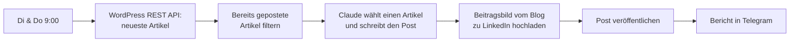

# LinkedIn-Autopost aus dem eigenen Blog (n8n + Claude)

Ein n8n-Workflow, der zweimal pro Woche automatisch einen LinkedIn-Post im persönlichen Profil veröffentlicht – geschrieben von Claude auf Basis der neuesten Artikel aus einem WordPress-Blog, mit dem Beitragsbild des Artikels.

Läuft produktiv seit September 2026 für [nikita-automation.de](https://nikita-automation.de).

*English summary: an n8n workflow that turns recent WordPress blog posts into native LinkedIn image posts (written in German by Claude) every Tuesday and Thursday. It talks to the LinkedIn Posts API directly because the built-in n8n LinkedIn node is pinned to a retired API version.*

## Was der Workflow macht



1. Holt die 10 neuesten Artikel über die WordPress REST API – inklusive Beitragsbild.
2. Filtert Artikel heraus, die schon auf LinkedIn waren (gespeichert in den Static Data des Workflows).
3. Claude bekommt bis zu 6 Kandidaten, wählt den mit dem größten praktischen Nutzen für Unternehmen und schreibt einen nativen LinkedIn-Post: Hook in der ersten Zeile, 3–4 Fakten, Einordnung, Frage an die Leser, 3 Hashtags.
4. Das Beitragsbild wird **nicht neu generiert**, sondern direkt vom Blog übernommen.
5. Veröffentlichung über die LinkedIn Posts API, danach eine Bestätigung mit Link per Telegram.
6. 10 Tage bevor der LinkedIn-Token abläuft, erinnert der Bericht daran, ihn zu erneuern.

## Stolpersteine, die ich lösen musste

**1. Der eingebaute LinkedIn-Node von n8n funktioniert nicht mehr.**
In n8n 2.8 ist der Header `LinkedIn-Version: 202504` fest im Code verankert. LinkedIn schaltet API-Versionen nach etwa einem Jahr ab – die Antwort lautet dann `Requested version 20250401 is not active`. Deshalb läuft die Veröffentlichung hier über HTTP-Request-Nodes mit den normalen LinkedIn-OAuth2-Credentials von n8n; die API-Version steht als Einstellung im Node „Settings" und lässt sich ohne Codeänderung anheben.

**2. Kommentare über die API sind nur für LinkedIn-Partner.**
Ursprünglicher Plan: Der Link zum Artikel kommt als erster Kommentar unter den Post (Posts mit externen Links bekommen weniger Reichweite). Mit dem Self-Service-Produkt „Share on LinkedIn" antwortet die API aber mit `403 Not enough permissions to access: partnerApiSocialActions.CREATE`. Der Post erscheint deshalb ohne Link.

**3. LinkedIn erwartet „Little Text".**
Zeichen wie `( ) [ ] { } < > @ | ~ _ *` müssen im Posttext escaped werden, sonst wird der Post abgelehnt oder abgeschnitten. Hashtags werden als `{hashtag|\#|KI}` übergeben.

**4. Claude antwortet mit mehreren Content-Blöcken.**
Neuere Modelle liefern vor dem Text einen `thinking`-Block. Der Parser nimmt daher gezielt den Block mit `type: "text"` statt einfach `content[0]`.

**5. fail2ban hat mich aus meinem eigenen n8n ausgesperrt.**
Die n8n-Oberfläche lädt beim Öffnen die Datei `/types/credentials.json`. Eine fail2ban-Regel gegen Scanner, die nach `credentials.json` suchen, hat das als Angriff gewertet. Lösung: eine `ignoreregex` für genau diesen Pfad.

## Einrichtung

### 1. LinkedIn-App
1. Auf [linkedin.com/developers/apps](https://www.linkedin.com/developers/apps) eine App anlegen. LinkedIn verlangt dafür eine Unternehmensseite – die App ist nur mit ihr verknüpft, gepostet wird trotzdem im persönlichen Profil.
2. Unter **Products** anfragen: *Share on LinkedIn* und *Sign In with LinkedIn using OpenID Connect* (werden sofort freigeschaltet).
3. Unter **Auth** als Redirect-URL eintragen: `https://<eure-n8n-domain>/rest/oauth2-credential/callback`

### 2. Credentials in n8n
| Credential | Typ | Hinweis |
|---|---|---|
| LinkedIn | *LinkedIn OAuth2 API* | Client ID + Secret aus der App, **Organization Support: aus**, **Legacy: aus** |
| Anthropic | *Header Auth* | Name `x-api-key`, Wert = API-Key aus der Anthropic Console |
| Telegram | *Telegram API* | Bot-Token von @BotFather |

### 3. Workflow importieren
1. `workflow/linkedin-autopost.json` in n8n importieren.
2. In den Nodes mit `REPLACE_ME` die eigenen Credentials auswählen.
3. Im Node **Telegram report** die eigene Chat-ID eintragen.
4. Im Node **Settings** anpassen:

| Feld | Bedeutung |
|---|---|
| `siteUrl` | WordPress-Seite, aus der die Artikel kommen |
| `systemPrompt` | Anweisungen für Claude (auch in `prompt/system-prompt.txt`) |
| `linkedinVersion` | LinkedIn-API-Version im Format `YYYYMM`, max. ~1 Jahr alt |
| `linkedinConnectedAt` | Datum der letzten LinkedIn-Autorisierung, für die Erinnerung |
| `excludePostIds` | WordPress-IDs, die nicht gepostet werden sollen, kommagetrennt |

5. Workflow aktivieren.

> **Hinweis:** Die Liste bereits geposteter Artikel wird nur bei geplanten Ausführungen gespeichert, nicht bei manuellen Testläufen. Artikel, die ihr manuell gepostet habt, tragt in `excludePostIds` ein.

## Wartung

- **LinkedIn-Token:** läuft nach 60 Tagen ab. In n8n unter Credentials → LinkedIn → *Reconnect*, danach `linkedinConnectedAt` aktualisieren.
- **API-Version:** LinkedIn schaltet Versionen nach etwa 12 Monaten ab. Bei `version is not active` einfach `linkedinVersion` anheben.
- **Fehler:** am besten einen Error-Workflow in den Workflow-Einstellungen hinterlegen, der per Telegram benachrichtigt.

## Kosten

Ein Post kostet mit Claude Sonnet etwa 3–4 Cent (rund 10.000 Input- und 700 Output-Tokens). Die LinkedIn-API ist kostenlos, n8n läuft selbst gehostet.

## Struktur

```
workflow/linkedin-autopost.json   n8n-Workflow zum Import
prompt/system-prompt.txt          Prompt für Claude
src/*.js                          Code der Code-Nodes (zum Lesen, ist im Workflow enthalten)
```

## Lizenz

MIT
